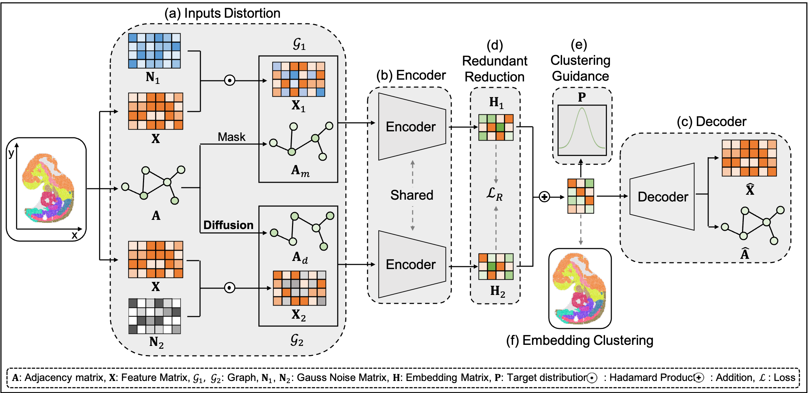

[](https://www.python.org/)

# SGAE: Deciphering spatial domains from spatially resolved transcriptomics with Siamese Graph Autoencoder
#Overview
Spatial transcriptomics (ST) is a newly emerging field that facilitates a comprehensive characterization of tissue 
organization and architecture. By profiling the spatially-resolved gene expression patterns, ST technologies 
allow scientists to gain an in-depth understanding of the complex cellular dynamics and within tissue. 
Graph neural network (GNN) based methods usually suffer from representations collapse, which tends to map spatial spots 
into same representation. To address this issue, we proposed a Siamese Graph Autoencoder (SGAE) framework to learn 
discriminative spot representation and decipher accurate spatial domains. SGAE outperformed those spatial clustering 
methods across multiple platforms derived datasets based on the evaluation of ARI, FMI, NMI. Moreover, the clustering 
results derived from the SGAE model can be further utilized in 3D Drosophila Embryo reconstruction.


# Dependences
[](https://github.com/scverse/anndata)
[](https://pypi.org/project/joblib/1.0.1/)
[](https://pypi.org/project/matplotlib/3.5.1/)
[](https://pypi.org/project/munkres/)
[](https://pypi.org/project/networkx/2.6.3/)
[](https://pypi.org/project/numpy/1.23.5/)
[](https://pypi.org/project/pandas/1.5.3/)
[](https://pypi.org/project/pickle5/)
[](https://pypi.org/project/POT/0.8.2/)
[](https://pypi.org/project/pynvml/)
[](https://pypi.org/project/scanpy/)
[](https://pypi.org/project/scikit-learn/1.0.2/)
[](https://pypi.org/project/scipy/1.6.2/)
[](https://pytorch.org/get-started/previous-versions/)
[](https://pypi.org/project/torch-geometric/2.3.1/)
[](https://pypi.org/project/tqdm/4.59.0/)

# Install

```git
git clone https://github.com/STOmics/SGAE.git

cd SGAE

python setup.py install
```

# Tutorial

- SGAE Pipeline           
  Decipher spatial domain in spatial transcriptomics.
  ```python       
   python3 run_case.py --n_epochs 1000

--n_epochs: the epochs of iteration in training process.

Please specify the dataset in run_case.py script. The default dataset is the
mouse cortex from MERFISH platform.

For more arguments, please check /utils/opt.py

### Code Ocean
We also upload our code to [Code Ocean](https://codeocean.com/capsule/4678327/tree). Please
check it for easier compilation.
# Disclaimer

***This is not an official product.***       
         
        


            
            
            
            
